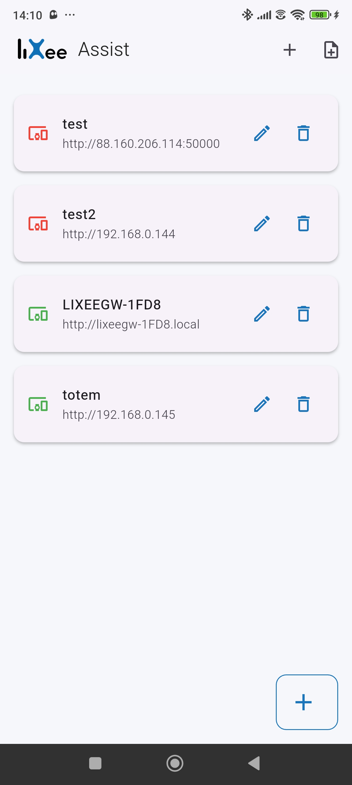
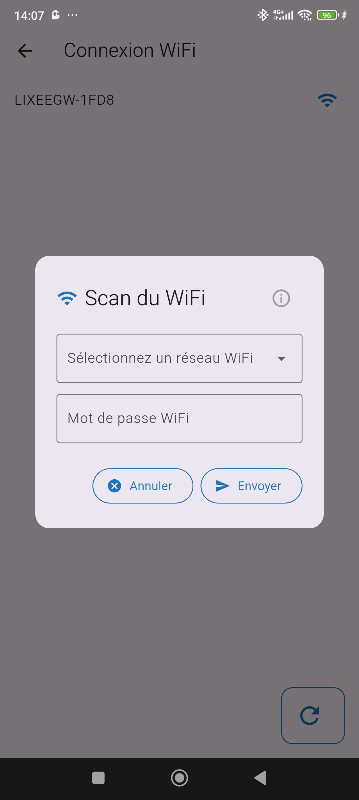
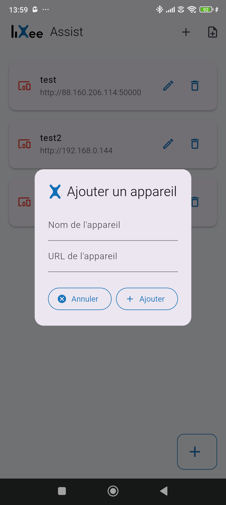
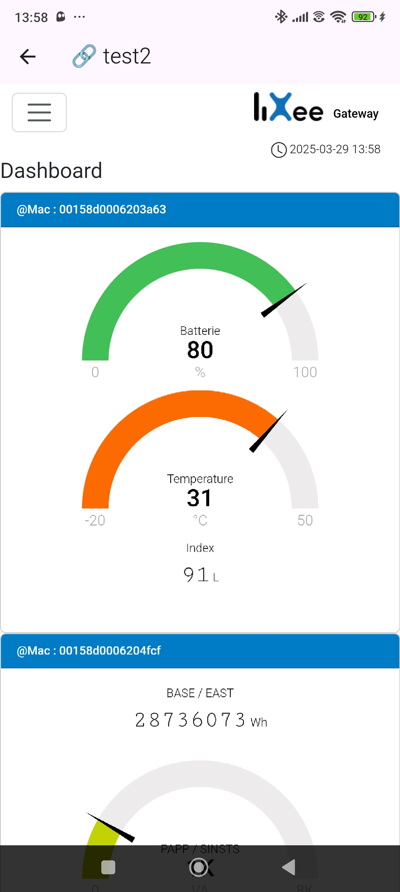

# 📱 LiXee-Assist

**LiXee-Assist** est une application mobile Android développée en Flutter permettant de détecter, configurer et gérer des appareils **LiXeeGW** via le WiFi. Elle propose un provisioning intelligent, une interface intuitive, et un support de résolution mDNS pour accéder aux interfaces embarquées.

---

## 📸 Aperçu





---

## ⚙️ Fonctionnalités

- 🔍 **Scan automatique des modules LiXee (SSID: LIXEEGW-xxxx)**
- 📶 **Connexion WiFi automatique avec mot de passe pré-rempli**
- 🌐 **Envoi de la configuration WiFi à l’appareil**
- 💾 **Sauvegarde des modules configurés (nom + URL)**
- 🖥 **Accès WebView à l’interface des modules**
- 🌍 **Support de la résolution mDNS** (pour les noms `*.local`)
- 🛠 **Ajout manuel d’un appareil (nom + IP ou URL)**
- 🧼 **Interface épurée, flat design, logo officiel LiXee intégré**

---

## 🏗 Technologies

- Flutter (Dart)
- Plugins :
    - [`wifi_iot`](https://pub.dev/packages/wifi_iot)
    - [`webview_flutter`](https://pub.dev/packages/webview_flutter)
    - [`shared_preferences`](https://pub.dev/packages/shared_preferences)
    - [`multicast_dns`](https://pub.dev/packages/multicast_dns)

---

## 🧪 Roadmap
- Rafraîchissement en arrière-plan de l'état des appareils
- Version iOS (selon compatibilité)

## 🚀 Installation & Déploiement

### 💻 Pré-requis

- Flutter SDK (v3.7+ recommandé)
- Android Studio
- Android 8.0+

### 🔧 Installation locale

```bash
git clone https://github.com/<ton-utilisateur>/lixee-assist.git
cd lixee-assist
flutter pub get
flutter run
```

## 📄 Licence
Ce projet est sous licence MIT 

