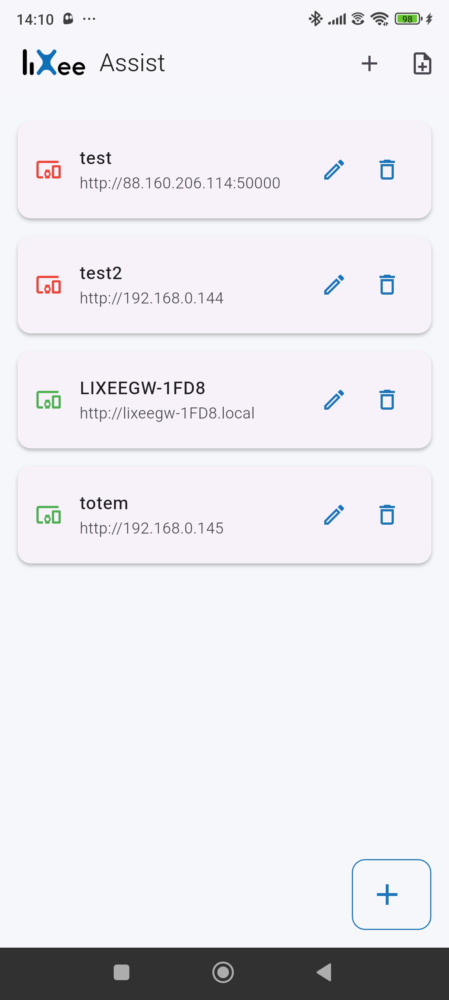
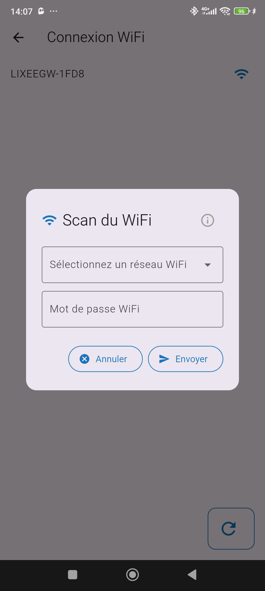
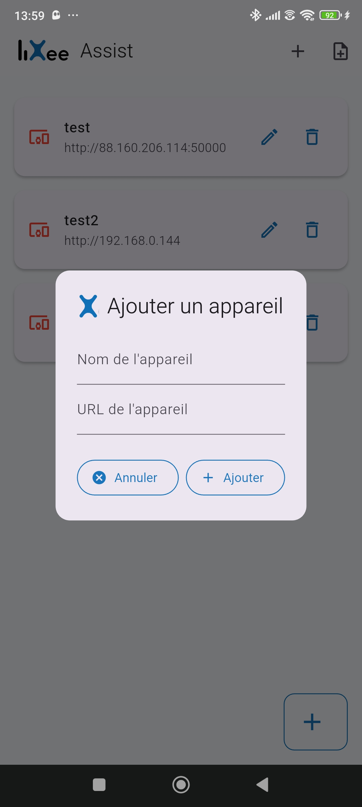
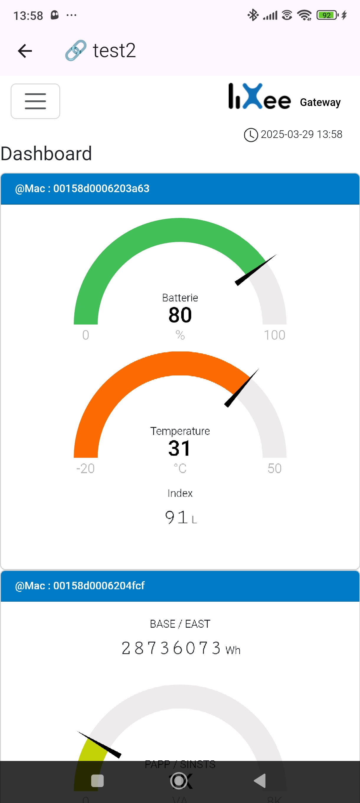

# 📱 LiXee-Assist

**LiXee-Assist** est l'application mobile officielle de [LiXee](https://lixee.fr) pour installer, piloter et surveiller vos modules **LiXee-Box** et **LiXeeGW**, sur Android et iOS.

<p>
  <a href="https://play.google.com/store/apps/details?id=com.lixee.assist"></a>
  <a href="https://apps.apple.com/app/lixee-assist/id6747671219"></a>
</p>

---

## 📸 Aperçu






---

## ⚙️ Fonctionnalités

### Installation des modules
- 🔵 **Configuration Bluetooth (BLE)** : détection des modules LiXee à proximité et transmission des identifiants WiFi, sans câble
- 🛠 **Ajout manuel** d'un module : nom, URL principale, URL de secours et identifiants
- 🌍 **Résolution mDNS** des noms `*.local`

### Accès aux box
- 🖥 **Interface web de la box intégrée**, via un proxy local : HTTP, HTTPS, authentification par formulaire ou Basic
- 🔁 **Accès distant automatique** : si un tunnel est configuré sur la box, l'app le détecte et bascule entre tunnel et réseau local selon ce qui répond. Un badge indique l'état : *Tunnel*, *Local* ou *Hors ligne*
- 📤 **Export CSV** : les fichiers exportés depuis l'interface de la box sont enregistrés sur le téléphone

### Surveillance
- 🔔 **Notifications push** (Firebase Cloud Messaging) envoyées par la box, pour les box dont le tunnel est configuré
- ⏱ **Relevé en arrière-plan** toutes les 15 minutes environ (Android) : disponibilité des box et mise à jour des widgets

### Widgets d'écran d'accueil (Android)
- ⚡ **Consommation, Production, Bilan** : relevés du Linky via la box. Puissance instantanée en jauge face à la puissance souscrite, énergie et montant sur 24 h, tendance sur l'heure écoulée, graphe heure par heure. Un appui sur la jauge rafraîchit le widget, un appui ailleurs ouvre la box dans l'app après confirmation
- 🪟 **Appareil Zigbee** : valeurs et commandes d'un appareil appairé (volet, prise, climatisation…), construites à partir des gabarits de la box. Position des volets en pourcentage, avec *ouvert* et *fermé* aux extrémités. Chaque commande demande confirmation
- ▶️ **Groupe d'actions** : un bouton, avec l'icône choisie sur la box, qui lance le groupe après confirmation (firmware 2.23 et plus)
- 🌡 **Thermostat virtuel** : consigne réglable directement (+/−), mode forcé (auto, marche, arrêt), chauffage ou refroidissement, hors-gel ; état de régulation et jauge comme sur la box
- Quand une box ne répond pas, le widget l'indique (*Injoignable*) plutôt que d'afficher des valeurs périmées

> Les widgets énergie pour iOS (iOS 17 et plus) sont en préparation.

### Et aussi
- 📺 **Android TV**, avec navigation à la télécommande

---

## 📋 Compatibilité

| | Version minimale |
|---|---|
| Android | 6.0 (API 23) |
| iOS | 15.0 |
| Firmware LiXee-Box | 2.23 pour le widget Groupe d'actions |

---

## 🏗 Technologies

- Flutter (Dart), Kotlin pour les widgets Android, Swift pour les widgets iOS
- Plugins principaux :
    - [`flutter_blue_plus`](https://pub.dev/packages/flutter_blue_plus) — communication BLE
    - [`wifi_scan`](https://pub.dev/packages/wifi_scan) / [`connectivity_plus`](https://pub.dev/packages/connectivity_plus) — réseaux WiFi et connectivité
    - [`flutter_inappwebview`](https://pub.dev/packages/flutter_inappwebview) — WebView
    - [`file_picker`](https://pub.dev/packages/file_picker) — enregistrement des exports
    - [`shelf`](https://pub.dev/packages/shelf) / [`shelf_proxy`](https://pub.dev/packages/shelf_proxy) — proxy local
    - [`home_widget`](https://pub.dev/packages/home_widget) — widgets d'écran d'accueil
    - [`firebase_messaging`](https://pub.dev/packages/firebase_messaging) — notifications push
    - [`workmanager`](https://pub.dev/packages/workmanager) — tâches en arrière-plan
    - [`flutter_local_notifications`](https://pub.dev/packages/flutter_local_notifications) — notifications locales
    - [`multicast_dns`](https://pub.dev/packages/multicast_dns) — résolution mDNS
    - [`dio`](https://pub.dev/packages/dio) / [`http`](https://pub.dev/packages/http) — clients HTTP

---

## 🚀 Compiler le projet

### 💻 Prérequis

- Flutter 3.29.3 (celui utilisé par Xcode Cloud)
- Android Studio, et Xcode avec CocoaPods pour iOS

### 🔧 Installation locale

```bash
git clone https://github.com/fairecasoimeme/LiXee-Assist.git
cd LiXee-Assist
flutter pub get
flutter run
```

Pour iOS, lancer `pod install` dans `ios/` avant d'ouvrir `ios/Runner.xcworkspace`. La mise en place de l'extension de widgets est décrite dans [`ios/LixeeWidgetsSources/README.md`](ios/LixeeWidgetsSources/README.md).

### 🧪 Tests

```bash
flutter test
```

---

## 📄 Licence

Ce projet est sous licence MIT : voir [LICENSE](LICENSE).
